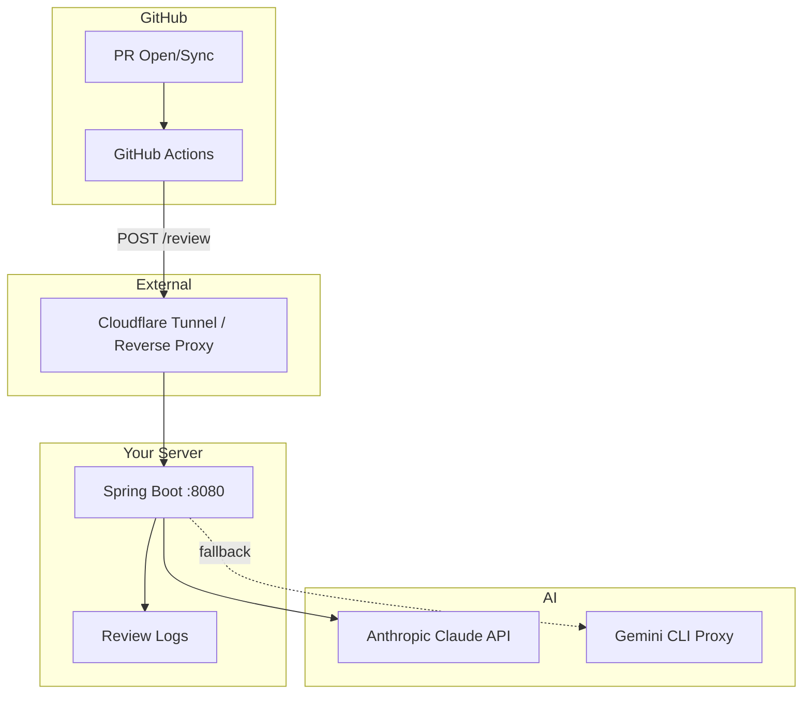

# claude-review

> Spring Boot 3.5 + Java 21 + Spring AI 1.0 기반 AI Code Review Bot

[](LICENSE)

## 프로젝트 소개

GitHub PR에 AI 코드 리뷰를 자동으로 달아주는 Spring Boot 애플리케이션입니다. GitHub Actions에서 webhook으로 리뷰를 요청하면, Anthropic Claude API를 사용해 코드를 분석하고 PR에 리뷰 코멘트를 작성합니다.

### 주요 기능

- **AI 코드 리뷰**: PR 생성/업데이트 시 자동으로 코드 리뷰 수행
- **멘토/시니컬 페르소나**: 학생용(Mentor)과 현업용(Cynic) 리뷰 스타일 제공
- **대화형 리뷰**: 리뷰에 대한 후속 질문 및 반박(Rebuttal) 기능
- **팀 리더보드**: 팀별 리뷰 통계 및 순위 제공
- **모니터링**: Prometheus + Grafana 기반 실시간 모니터링
- **페일오버**: 듀얼 서버 자동 페일오버 지원

---

## 아키텍처



### 핵심 컴포넌트

| 컴포넌트 | 역할 |
|----------|------|
| `ReviewController` | 리뷰 요청 처리 (`/review`) |
| `GitHubService` | GitHub API 연동 (PR diff, 코멘트 작성) |
| `ReviewService` | 리뷰 로직 및 프롬프트 관리 |
| `LeaderboardService` | 팀별 리뷰 통계 수집 |
| `AuthInterceptor` | 시크릿 키 + Owner 화이트리스트 인증 |
| `RateLimitInterceptor` | IP당 요청 제한 |

---

## 디렉토리 구조

```
claude-review/
├── claude-review-server/          # Spring Boot 메인 애플리케이션
│   ├── src/main/java/             # Java 21 소스
│   │   └── com/review/server/
│   │       ├── controller/        # REST 컨트롤러
│   │       ├── service/           # 비즈니스 로직
│   │       ├── config/            # 설정 클래스
│   │       └── model/             # 데이터 모델
│   ├── src/main/resources/
│   │   ├── application.yml        # 애플리케이션 설정
│   │   └── templates/             # Thymeleaf 템플릿
│   ├── monitoring/                # Prometheus + Grafana 설정
│   ├── docker-compose.yml         # Docker Compose 배포
│   └── deploy.sh                  # 배포 스크립트
├── server/                        # Node.js v1 (레거시)
├── cli-proxy/                     # Gemini 폴백 프록시
├── evals/                         # 평가 파이프라인 (Node.js 18+)
│   ├── eval-runner.mjs            # 평가 실행기 (공식)
│   ├── judge-client.mjs           # LLM-as-Judge
│   ├── eval-runner.py             # 평가 실행기 (Python 백업)
│   ├── judge_client.py            # LLM-as-Judge (Python 백업)
│   ├── eval-config.yaml           # 평가 설정
│   └── golden-dataset/            # 골든 데이터셋
└── docs/                          # 문서
```

---

## Quick Start

### 사전 요구사항

- Java 21 (JDK)
- Docker & Docker Compose
- Anthropic API 키 또는 z.ai 게이트웨이 키
- GitHub 계정

### 1. 클론 및 설정

```bash
git clone https://github.com/your-username/claude-review.git
cd claude-review/claude-review-server

# 환경변수 설정
cp .env.example .env
```

### 2. 환경변수 구성

`.env` 파일을 열어 다음 값을 설정합니다:

```bash
# 필수 설정
DOMAIN=your-domain.com                    # 또는 localhost
ANTHROPIC_API_KEY=your-api-key-here       # Anthropic API 키

# 보안 설정
REVIEW_SECRET=                            # 리뷰 인증용 시크릿 (openssl rand -hex 32 로 생성)

# GitHub 연동
ALLOWED_GITHUB_OWNERS=your-org,another-org # 허용할 GitHub Owner 목록 (콤마 구분)

# 모니터링 (선택)
GRAFANA_ADMIN_PASSWORD=                   # Grafana 관리자 비밀번호
```

### 3. 빌드 및 실행

```bash
# Gradle 빌드
./gradlew build

# Docker Compose로 실행
docker compose up -d

# 또는 로컬에서 직접 실행
./gradlew bootRun
```

### 4. 헬스체크

```bash
curl http://localhost:8080/health
# {"status":"ok"}
```

### 5. GitHub Actions 연동

PR 생성 시 자동으로 리뷰가 실행되도록 GitHub Actions 워크플로우를 설정합니다:

```yaml
# .github/workflows/ai-review.yml
name: AI Code Review
on:
  pull_request:
    types: [opened, synchronize]

jobs:
  review:
    runs-on: ubuntu-latest
    steps:
      - uses: actions/checkout@v4
        with:
          fetch-depth: 0

      - name: Request AI Review
        env:
          REVIEW_SECRET: ${{ secrets.REVIEW_SECRET }}
        run: |
          DIFF=$(git diff origin/main...HEAD)
          curl -X POST https://your-domain.com/review \
            -H "Content-Type: application/json" \
            -H "x-review-secret: $REVIEW_SECRET" \
            -H "x-github-repo: ${{ github.repository }}" \
            -d "{\"diff\": \"$DIFF\", ...}"
```

**GitHub 저장소에 Secret 등록:**
1. 저장소 Settings → Secrets and variables → Actions
2. `REVIEW_SECRET` 에 `.env`에 설정한 값과 동일한 시크릿 저장

---

## API Endpoints

| Method | Path | Auth | 설명 |
|--------|------|------|------|
| POST | `/review` | 시크릿 + 레포 헤더 | 코드 리뷰 요청 |
| POST | `/review/conversation` | 시크릿 + 레포 헤더 | 대화형 후속 질문 |
| POST | `/review/rebuttal` | 시크릿 + 레포 헤더 | 반박 응답 생성 |
| GET | `/health` | 없음 | 헬스체크 |
| GET | `/` | 없음 | 홈 (팀 순위, 체인지로그) |
| GET | `/stats` | 없음 | 통계 페이지 (HTML) |
| GET | `/api/dashboard/summary` | 없음 | 대시보드 요약 (JSON) |
| GET | `/api/dashboard/leaderboard` | 없음 | 팀 리더보드 (JSON) |
| GET | `/leaderboard` | 없음 | 리더보드 페이지 (HTML) |
| GET | `/release` | 없음 | 릴리즈 노트 |

---

## 테스트

```bash
# 단위 테스트
./gradlew test

# JaCoCo 커버리지 리포트
./gradlew jacocoTestReport

# 통합 테스트
./gradlew integrationTest
```

---

## 평가 파이프라인 (evals/)

```bash
# Dry-run (API 호출 없음, 시크릿 불필요)
node evals/eval-runner.mjs --dry-run

# 골든 데이터셋 기반 평가 실행
REVIEW_SECRET=your-secret node evals/eval-runner.mjs

# LLM-as-Judge 평가 (Anthropic API 키 필요)
REVIEW_SECRET=your-secret ANTHROPIC_API_KEY=your-key \
  node evals/eval-runner.mjs --with-judge --meta-eval
```

---

## Tech Stack

| 레이어 | 기술 |
|--------|------|
| 서버 | Java 21, Spring Boot 3.5, Spring AI 1.0 |
| AI 모델 | Claude Sonnet 4 (주), Claude Haiku 4.5 (반박), Gemini (폴백) |
| 빌드 | Gradle (Kotlin DSL) |
| 테스트 | JUnit 5, Mockito, JaCoCo |
| 모니터링 | Prometheus, Grafana, Spring Actuator |
| 인프라 | Docker Compose, Nginx Proxy Manager, Cloudflare Tunnel |
| CI/CD | GitHub Actions |
| 보안 | 시크릿 기반 인증, GitHub Owner 화이트리스트, IP Rate Limiting |

---

## 보안 구조

```
레이어              역할
──────────────────────────────────────────────────────
Cloudflare Access   모니터링 대시보드 인증
Nginx Proxy Manager 리버스 프록시 + SSL 종료
AuthInterceptor      x-review-secret 시크릿 키 검증
AuthInterceptor      x-github-repo 헤더 + owner 화이트리스트
RateLimitInterceptor IP당 분당 10회 제한
Docker Compose       내부 서비스 포트 미노출
```

모든 인증 실패 → **404 반환** (엔드포인트 존재 여부 노출 차단)

---

## License

This project is licensed under the Apache License 2.0 — see the [LICENSE](LICENSE) file for details.
